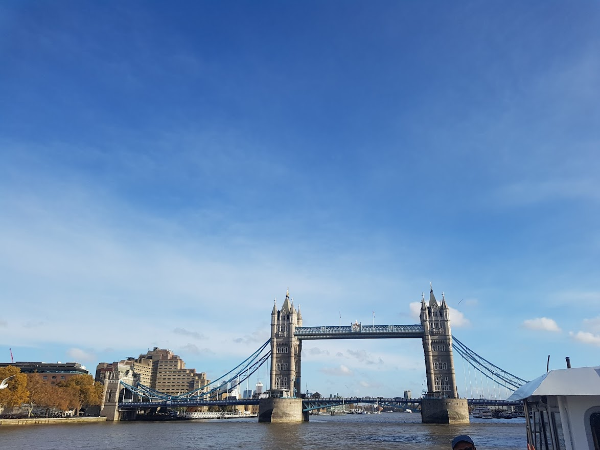

<!DOCTYPE html>
<html lang="en"> 
  <head> 
    <link rel="stylesheet" type="text/css" href="style1.css">     <meta name="viewport" content="width=device-width,     initial-scale=1.0"> 
  </head>

<body> 
  

    <h1 class="title">Дмитренко Роман Андрійович</h1>
    
Народився в м.Києві 05 травня 1984 року

    
Навчався в ліцеї №142 в м.Києві

    
Хоббі:

    <ul>
      <li>Читати книжки</li>
      <li>Дивитися фільми</li>
      <li>Спорт</li>
    </ul>
    
Улюблені фільми:

    <ol>
      <li>Інтерстеллар</li>
      <li>Джентельмени (реж. Гай Річі)</li>
      <li>Щасливе число Слевіна</li>
    </ol>
        
    <h3>місто Лондон</h3>
    
Лондон (англ. London) — столиця Великої Британії та одне з найбільших міст Європи, 
        що є світовим центром культури, музики, освіти, моди, політики, фінансів і торгівлі. 
        Це яскравий і галасливий мегаполіс з динамічним життям і чудовою космополітичною атмосферою. 
        Лондон — одне з найдавніших міст Європи, яке має дивовижну концентрацію різних пам’яток, пам’яток 
        історії та культури: розкішні палаци, історичні будівлі, вежі, мости, старовинні церкви, атракціони 
        та музеї світового рівня.

        
Лондон був заснований за часів Римської імперії та протягом своєї багатої історії був одним з найважливіших 
        міст Європи. Сюди стікалися всі багатства Сполученого Королівства, тому його столиця має чудові пам’ятки самих 
        різних історичних епох. Лондон — одне з найбільш багатогранних міст у світі, яке увібрало в себе не тільки традиції 
        Британії, а й культури багатьох національностей і народів. Це місце приголомшливого різноманіття, яке можна відкривати 
        та досліджувати нескінченно.

    

  

</body>
</html>